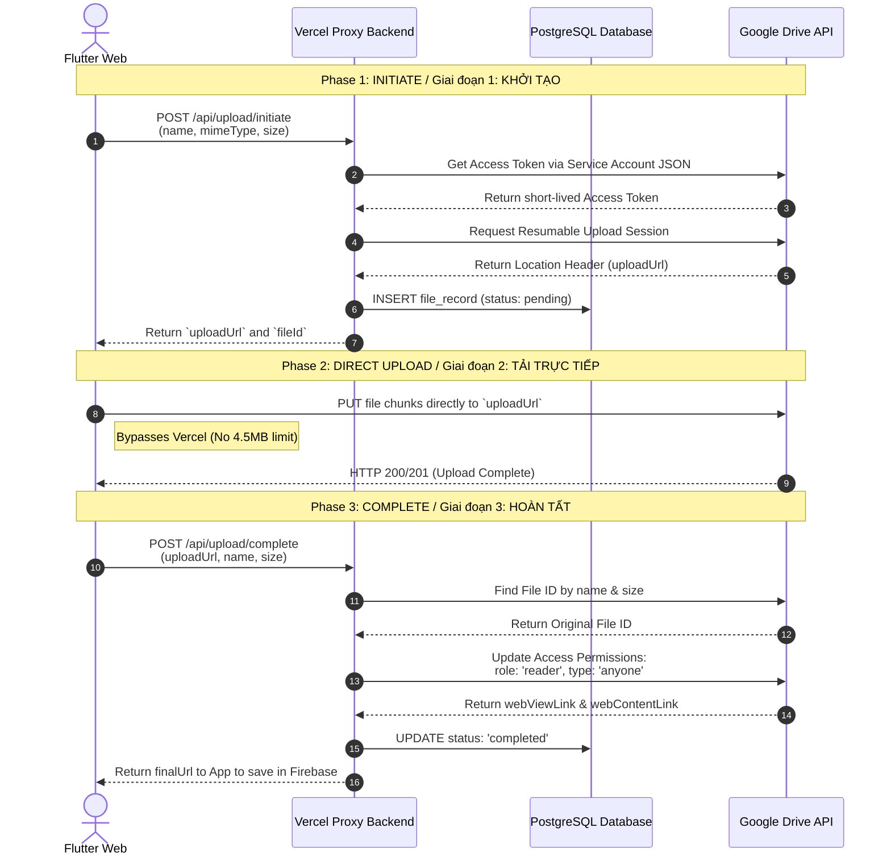

# Architecture: Google Drive API + Vercel Proxy Backend
# Kiến trúc: Google Drive API kết hợp Vercel Proxy Backend

This document explains how the LMS system handles large file uploads (Video Lectures, PDFs, etc.) securely and efficiently by combining **Google Drive** and **Vercel Serverless Functions**.
*Tài liệu này giải thích cách hệ thống LMS xử lý việc lưu trữ các file dung lượng lớn (Video Bài giảng, PDF, v.v.) một cách an toàn và tối ưu bằng cách kết hợp **Google Drive** và **Vercel Serverless Functions**.*

---

## 1. The Problem / Vấn Đề Cần Giải Quyết

When using Google Drive as a storage solution for a Web App (Flutter Web):
*Khi sử dụng Google Drive làm bộ lưu trữ cho Web App (Flutter Web):*

- **Security (Bảo mật):** You cannot directly embed the API Key or Service Account credentials in Flutter Web, as anyone opening DevTools (F12) can steal them and delete your Drive. *(Không thể nhúng trực tiếp API Key hoặc Service Account credentials vào Flutter Web, vì bất kỳ ai mở F12 cũng có thể đánh cắp và xóa sạch Drive.)*
- **Serverless Bandwidth Limits (Giới hạn băng thông Serverless):** If files are routed through a Backend (like Vercel), the payload size is strictly limited (e.g., 4.5 MB on Vercel free tier). *(Nếu đẩy file qua một Backend (như Vercel), thì Vercel giới hạn dung lượng tải lên mỗi request rất nhỏ - chỉ 4.5 MB.)*
- **CORS:** Google Drive does not support Direct Uploads from a Web Client without pre-configured certificates or backend proxies. *(Google Drive không hỗ trợ tải file trực tiếp (Direct Upload) từ Client Web nếu không có chứng chỉ bảo mật cấu hình sẵn.)*

---

## 2. The Solution: Resumable Upload + Direct Client-to-Drive
## Giải pháp: Tải lên Tiếp nối + Trực tiếp từ Client lên Drive

To solve this, the architecture splits the upload flow into 3 distinct phases:
*Để giải quyết vấn đề, kiến trúc này chia luồng tải lên làm 3 giai đoạn:*

1. **Initiate (Khởi tạo):** The Vercel Backend acts as a "negotiator" to request a direct upload link (`uploadUrl`) from Google Drive. *(Vercel Backend đóng vai trò "người đàm phán" để xin Google Drive cấp một đường link tải lên trực tiếp - `uploadUrl`.)*
2. **Direct Upload (Tải trực tiếp):** The Client (Flutter) uses that link to upload the file chunks straight to Google Drive, bypassing Vercel completely. This consumes zero Vercel bandwidth and bypasses the 4.5MB limit. *(Client dùng đường link đó để bắn thẳng file lên Google Drive, không đi qua Vercel nữa. Không tốn băng thông Vercel, không bị giới hạn 4.5MB.)*
3. **Complete (Hoàn tất):** The Vercel Backend grants "Anyone can view" permissions to the file and returns the final viewing/downloading links to the Client. *(Vercel Backend cấp quyền chia sẻ "Anyone can view" và trả về link xem/tải cuối cùng cho Client.)*

---

## 3. Sequence Diagram / Sơ đồ Luồng Hoạt Động

---

## 4. Why is this architecture powerful? / Tại sao cấu trúc này cực kỳ mạnh mẽ?

1. **Absolute Security (Bảo mật tuyệt đối):** The Google Drive Service Account (with the private key) is only stored as an environment variable on the Vercel server. Flutter Web is completely unaware of these credentials. *(Service Account của Google Drive chỉ được lưu trữ dưới dạng biến môi trường trên máy chủ Vercel. Flutter Web hoàn toàn không biết cấu hình này.)*
2. **High Performance (Hiệu suất cao):** The Client directly uploads files to Google's global network, achieving maximum speed with the ability to pause/resume easily. *(Client tải file trực tiếp thẳng lên mạng lưới toàn cầu của Google, đạt tốc độ cao nhất và có thể tạm dừng/tiếp tục dễ dàng.)*
3. **Cost Efficiency (Tiết kiệm chi phí):** Storage is entirely free (15GB/Drive or unlimited via Google Workspace). Vercel incurs zero bandwidth costs because the files do not route through it. PostgreSQL is only used for lightweight state management. *(Lưu trữ hoàn toàn miễn phí. Vercel không bị tính phí băng thông vì file không đi qua Vercel. PostgreSQL chỉ dùng để lưu trạng thái file siêu nhẹ.)*
4. **CORS Bypass (Không bị chặn CORS):** The request to fetch the URL happens server-side, while the URL generated by Google during the *Resumable Upload* phase defaults to allowing all Origins (if proper headers are sent during initialization). *(Yêu cầu lấy link diễn ra ở Server-side, còn URL được Google sinh ra trong quá trình *Resumable Upload* mặc định cho phép mọi Origin.)*

---

## 5. Corresponding Code Files / Các tập tin Code tương ứng

- **Initiate:** `vercel_backend/api/upload/initiate.ts`
- **Complete:** `vercel_backend/api/upload/complete.ts`
- **Drive Permissions Management:** `vercel_backend/utils/drive.ts`
- **Client Side (Dart):** `lib/src/firebase/google_drive_storage_provider.dart` (`uploadFileWeb` method)
