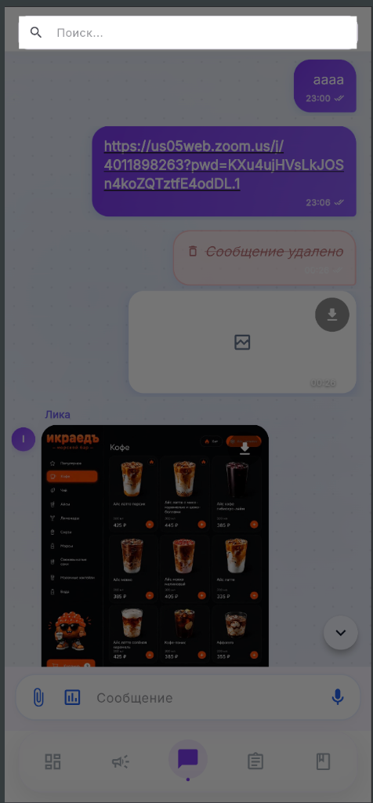
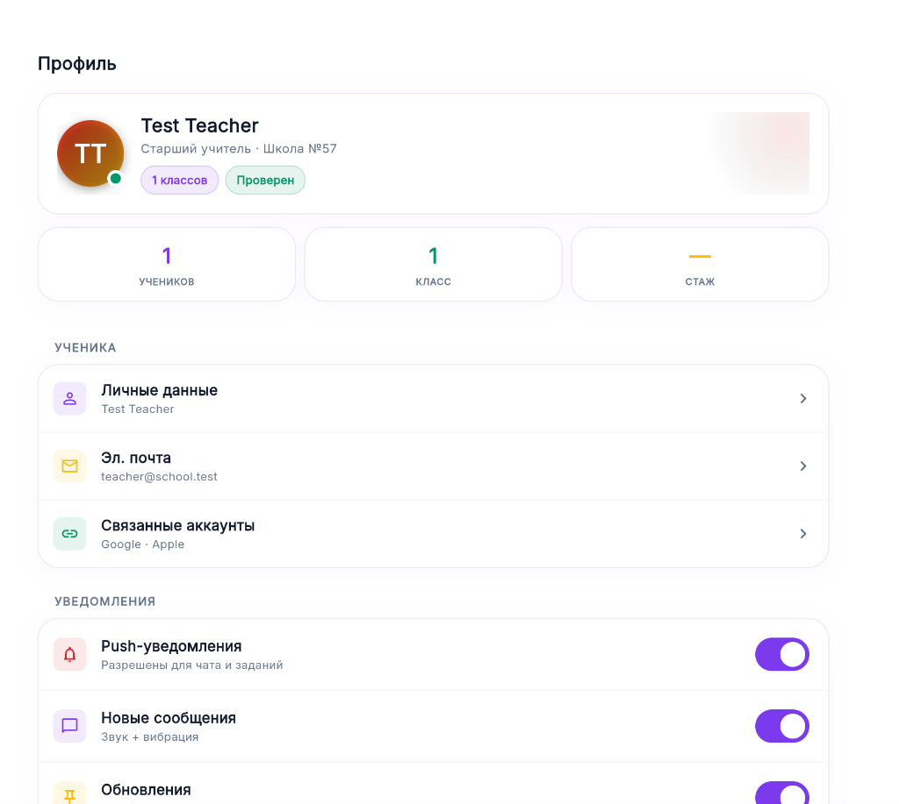
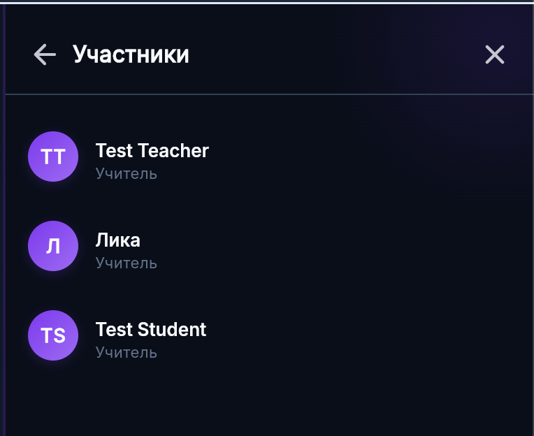

# Talentum — Hệ Thống Giáo Dục Học Đường Kết Nối (Connected Classroom Platform)

Talentum (tên cũ: *School World*) là một hệ sinh thái giáo dục đa nền tảng hiện đại được thiết kế để thu hẹp khoảng cách giao tiếp và quản lý giữa **Giáo viên**, **Học sinh** và **Phụ huynh**. Dự án kết hợp các tính năng giao tiếp thời gian thực, quản lý bài tập về nhà, số điểm và bảng thống kê học tập thành một trải nghiệm liền mạch, có tính thẩm mỹ và hiệu năng cao.

Ứng dụng được triển khai thử nghiệm trực tiếp tại: **[talentum.web.app](https://talentum.web.app)**

---

## 📸 Giao Diện Ứng Dụng (Screenshots)

<p align="center">
  
  
  
</p>

---

## 🚀 Tính Năng Nổi Bật (Key Features)

### 👨‍🏫 Dành Cho Giáo Viên (For Teachers)
*   **Bảng Điều Khiển Tổng Quan (Teacher Today):** Quản lý lịch dạy trong ngày, thống kê nhanh, xem hồ sơ cá nhân và các hoạt động lớp học.
*   **Quản Lý Lớp Học & Thành Viên:** Tạo các lớp học trực tuyến, tạo mã mời học sinh và phụ huynh tham gia dễ dàng.
*   **Sổ Điểm & Chủ Đề (Журнал):** Quản lý danh sách điểm số theo từng môn học (Предметы), cập nhật tiến trình giảng dạy thời gian thực.
*   **Giao Bài Tập & Phản Hồi:** Tạo bài tập với hạn chót, đính kèm tệp tin đa phương tiện và chấm điểm trực tiếp cho học sinh.

### 🎓 Dành Cho Học Học Sinh (For Students)
*   **Trò Chuyện Nhóm Lớp Học (Class Chat):** Kênh giao tiếp cực đẹp sử dụng cơ chế Glassmorphism. Hỗ trợ tin nhắn thoại, đính kèm ảnh/tệp tin, thả cảm xúc emoji tương tác và tìm kiếm tin nhắn không chặn màn hình (inline search).
*   **Cổng Bài Tập (Homework Portal):** Theo dõi danh sách bài tập sắp đến hạn, xem hướng dẫn chi tiết và nộp bài trực tiếp từ điện thoại.
*   **Báo Cáo Điểm Số:** Xem điểm số thời gian thực và nhận phản hồi chi tiết từ giáo viên ngay lập tức.

### 👪 Dành Cho Phụ Huynh (For Parents)
*   **Giám Sát Tiến Độ:** Theo dõi việc nộp bài và bảng điểm của con em mình trên các lớp học khác nhau.
*   **Nhận Thông Báo:** Luôn cập nhật các thông báo mới từ nhà trường và giáo viên chủ nhiệm.

---

## 🛠 Công Nghệ Sử Dụng (Tech Stack)

*   **Frontend (Ứng Dụng Chính):** **Flutter (Dart 3+)** — Đảm bảo hiệu năng mượt mà 60fps trên Web, iOS, Android, macOS và Windows.
*   **UI/UX Design:** Phong cách thiết kế **Glassmorphism** cao cấp, chuyển động mượt mà, tối ưu hóa kích thước màn hình responsive trên thiết bị di động.
*   **Backend & Cloud Services:** **Firebase**
    *   **Firebase Authentication:** Xác thực an toàn qua Số điện thoại và Email/Mật khẩu.
    *   **Cloud Firestore:** Cơ sở dữ liệu NoSQL thời gian thực để lưu trữ tin nhắn, điểm số, bài tập.
    *   **Firebase Hosting:** Triển khai ứng dụng web tốc độ cao với các cấu hình Cache tối ưu.
    *   **Firebase Storage:** Quản lý tài liệu lớp học và bài tập của học sinh.
*   **Telegram Cloud Storage (Teldrive):** Giải pháp lưu trữ đám mây dung lượng lớn tối ưu cho tài liệu giảng dạy nặng và đa phương tiện.

---

## 📂 Cấu Trúc Thư Mục (Folder Structure)

```text
.
├── school_world/            # Mã nguồn chính ứng dụng Flutter
│   ├── lib/src/             # Source code nghiệp vụ & giao diện
│   │   ├── features/        # Phân chia Module theo Feature-First (Chat, Journal, Grades, Settings...)
│   │   ├── firebase/        # Repository tích hợp Firebase Services
│   │   └── widgets/         # Thư viện UI components dùng chung
│   └── l10n/                # Đa ngôn ngữ (English, Russian, Vietnamese)
├── Realtime Chat app/       # Bản mẫu thiết kế UI/UX dạng React Prototype
└── functions/               # Firebase Cloud Functions (Node.js) để chạy tác vụ ngầm
```

---

## 🚦 Hướng Dẫn Cài Đặt (Getting Started)

### Yêu Cầu Hệ Thống
*   Đã cài đặt **Flutter SDK (phiên bản 3.19.0 trở lên)**
*   Đã cài đặt **Dart SDK**
*   Trình duyệt Google Chrome hoặc giả lập Android/iOS.

### Các Bước Thực Hiện

1.  **Di chuyển vào thư mục ứng dụng:**
    ```bash
    cd school_world
    ```

2.  **Cài đặt các gói phụ thuộc:**
    ```bash
    flutter pub get
    ```

3.  **Tạo file đa ngôn ngữ tự động:**
    ```bash
    flutter gen-l10n
    ```

4.  **Chạy ứng dụng chế độ Debug:**
    ```bash
    flutter run -d chrome  # Chạy trên trình duyệt Web
    # HOẶC
    flutter run            # Chạy trên thiết bị di động / máy ảo
    ```

---

## 🌟 Các Cải Tiến Gần Đây (Recent Updates)
*   **Inline Chat Search:** Sửa lỗi giao diện tìm kiếm tin nhắn trên di động. Thay thế cửa sổ đè màn hình bằng thanh SearchBar tích hợp trực tiếp trên Header cực kỳ mượt mà.
*   **Firebase Hosting & Custom Domain:** Đã cấu hình và chuyển đổi tên miền chính thức sang **talentum.web.app** với cấu hình Cache-Control tối ưu hiệu năng tải trang.
*   **Responsive Layouts:** Tối ưu kích thước Padding, Grid, và các Thẻ Thống Kê (Stats) tự động co giãn hoàn hảo trên màn hình điện thoại siêu nhỏ.

---
Phát triển với ❤️ bởi **Do Quoc Chi** (@gookjiii) và đội ngũ Talentum.
